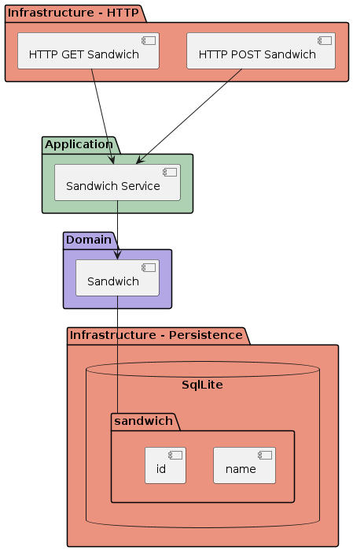

### Sandwicher service

This service has been built following several architecture paradigms:
- [Hexagonal](https://alistair.cockburn.us/hexagonal-architecture/)
- [Domain-Driven Design](https://martinfowler.com/bliki/DomainDrivenDesign.html) (DDD)
- [Command and Query Separation](https://martinfowler.com/bliki/CommandQuerySeparation.html) (CQS)
- [SOLID](https://en.wikipedia.org/wiki/SOLID) principles

### 

### Setup

- Rust >= 1.72.1
- Docker >= 24.0.5

### Requirements

To install
```bash
$ cargo run
```

### Run unit tests

```bash
$ cargo test
```

### Start the application

1. Build Docker image

```bash
$ docker build -t sandwicher .
```

2. Run the container

```bash
docker run sandwicher
```

### What is missing ? Unordered response

- Feature test to verify e2e workflow

- Integration test at the component level to test infrastructure store adapter and database together to verify that sandwich store methods store data correctly.

- Unit tests:
    - service layer tests should cover unhappy paths

- Proper logging system in a shared infrastructure.